  <picture>
    <source media="(prefers-color-scheme: dark)" srcset="./dark.svg">
    <source media="(prefers-color-scheme: light)" srcset="./light.svg">
    
  </picture>

  
  
  
  

---

## Syed Saifullah Shah

**DevOps Engineer** — BS (CS) Graduate, FAST National University of Computer & Emerging Sciences, specialized in **Computer Networking and Security**.

I work across the infrastructure side of software delivery: designing and securing network architectures, automating with Python, and building on cloud platforms. My focus is turning complex technical requirements into solutions I can actually explain, demonstrate and hand over — through technical presentations, requirements gathering and proposal writing.

## Focus

<table>
<tr><td width="50%" valign="top">

**Networking**
- IPv4 / IPv6 addressing design
- VLANs and inter-VLAN routing
- Routing protocols — OSPF, BGP
- VPN design

</td><td width="50%" valign="top">

**Security**
- Firewall deployment — Cisco ASA
- NAT / PAT
- Access Control Lists (ACLs)
- Multi-level access control design

</td></tr>
<tr><td valign="top">

**Cloud**
- AWS EC2
- AWS S3
- AWS CLI / API automation

</td><td valign="top">

**Automation & Languages**
- Python, Java, C / C++, Assembly
- Bash and shell scripting
- JavaScript, HTML5, CSS3, Bootstrap

</td></tr>
</table>

## Projects

### Genomic Data Analysis Solution — *Final Year Project*
Engineered an end-to-end automated system that uses Machine Learning to classify raw genomic data, streamlining the gene identification process. Full-stack delivery with Python and Angular 7, backed by MongoDB, with an SVM classifier.
Presented the technical feasibility and social impact to KPK government officials, resulting in formal appreciation and consideration for regional implementation by KPITB.

`Python` · `SVM` · `Angular 7` · `HTML5` · `CSS3` · `MongoDB`

### Service-Sector Resource Management Platform — *Semester Project*
Identified gaps in local labour markets and designed a recommendation engine for matching users with service providers. Included a transparent pricing and billing module demonstrating financial ROI and operational efficiency, plus a responsive web interface built for live technical demonstrations.

`Python` · `NumPy` · `Pandas` · `Anaconda` · `JavaScript` · `HTML` · `CSS`

### Hospitality ERP Prototype — *Database Project*
Architected a web portal for real-time room-booking inventory and mess schedules, with a secure multi-level access control panel separating Admin and User privileges.

`HTML5` · `CSS3` · `JavaScript` · `PHP` · `Bootstrap` · `MySQL`

### Enterprise Multi-Site Network Design — *Virtual Lab*
Designed and simulated a redundant enterprise-grade network in Cisco Packet Tracer with a dual-stack IPv4/IPv6 addressing scheme for future-proof scalability. Segmented departmental traffic with VLANs and inter-VLAN routing, and hardened the perimeter with Cisco ASA firewall configurations, NAT/PAT and ACLs.

`Cisco Packet Tracer` · `IPv4/IPv6` · `VLAN` · `OSPF` · `Cisco ASA` · `NAT/PAT` · `ACL`

## Stack

`Python` `C/C++` `Java` `Assembly` `JavaScript` `HTML5` `CSS3` `Bootstrap` `PHP` `WordPress`
`AWS EC2` `AWS S3` `AWS CLI` `Oracle 12c` `MySQL` `MS Access` `MongoDB`
`Cisco Packet Tracer` `Git` `GitHub` `GitLab` `VS Code` `PhpStorm`

## Beyond the Terminal

- Represented FAST-NUCES in national speed programming competitions, including **SOFTEC** and **NASCON**.
- Project concept appreciated by **KPITB** for regional implementation.

## Connect

| | |
|---|---|
| **GitHub** | [github.com/saifullah-shah](https://github.com/saifullah-shah) |
| **LinkedIn** | [in/syed-saifullah-shah-9702a6154](https://www.linkedin.com/in/syed-saifullah-shah-9702a6154/) |
| **Email** | [tirmezi.17@gmail.com](mailto:tirmezi.17@gmail.com) |
| **Phone** | [+92 302 5733496](tel:+923025733496) |

---

Banner rendered as a self-contained animated SVG — no scripts, no external assets. Dark and light variants are hand-tuned separately for each colour scheme.
